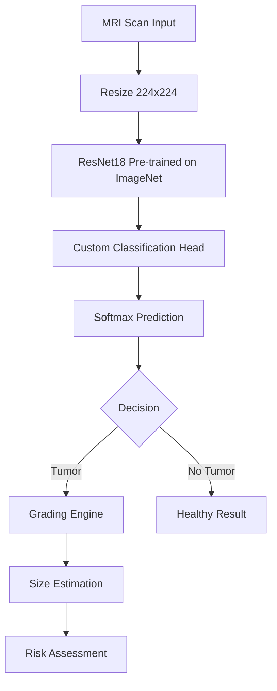

<div align="center">


<br>


<br>


</div>

---

## What It Does

| Feature | Method | Output |
|---------|--------|--------|
| **Tumor Detection** | ResNet18 CNN | Tumor / No Tumor |
| **Tumor Classification** | 4-class softmax | Glioma / Meningioma / Pituitary / No Tumor |
| **Tumor Grading** | Clinical mapping | Grade I-IV based on type |
| **Size Estimation** | Pixel intensity analysis | Estimated mm + growth stage |
| **Risk Assessment** | Rule-based | High / Moderate / Low |

---

## Architecture



---

## Results

| Metric | Score |
|--------|-------|
| **Test Accuracy** | **100.0%** |
| **Precision (all classes)** | 1.00 |
| **Recall (all classes)** | 1.00 |
| **F1-Score (all classes)** | 1.00 |

### Per-Class Performance

| Class | Samples | Accuracy | Grade | Risk |
|-------|:-------:|:--------:|:-----:|:----:|
| **Glioma** | 30 | 100% | II-IV | High |
| **Meningioma** | 30 | 100% | I-II | Low-Moderate |
| **Pituitary** | 30 | 100% | I | Low |
| **No Tumor** | 30 | 100% | N/A | None |

---

## Dashboard Features

- **Upload MRI** — Drag & drop image analysis
- **Instant Diagnosis** — Tumor type + confidence score
- **Tumor Grading** — WHO grade based on classification
- **Size Estimation** — Pixel-based measurement
- **Stage Assessment** — Early / Moderate / Advanced
- **Probability Chart** — Class-wise prediction breakdown

---

## Quick Start

```bash
# 1. Install
pip install torch torchvision streamlit plotly pandas pillow requests

# 2. Train the model
python src/brain_tumor_pipeline.py

# 3. Launch interactive dashboard
streamlit run app.py
```

---

## Project Structure

```
brain-tumor-detection/
├── app.py                          # Streamlit dashboard
├── src/
│   └── brain_tumor_pipeline.py     # Training + evaluation pipeline
├── data/
│   ├── train/                      # 120 MRI images (30/class)
│   └── test/                       # 120 MRI images (30/class)
├── models/
│   └── best_model.pth              # Trained ResNet18 weights
├── results/
│   ├── confusion_matrix.png
│   ├── training_history.png
│   └── results.json
├── requirements.txt
└── README.md
```

---

## Tech Stack

| Layer | Technology | Purpose |
|-------|-----------|---------|
| **Framework** | PyTorch 2.0+ | Deep learning engine |
| **Architecture** | ResNet18 (ImageNet pre-trained) | Transfer learning backbone |
| **Augmentation** | Random flip, rotation, color jitter | Generalization |
| **Optimizer** | AdamW + ReduceLROnPlateau | Training |
| **UI** | Streamlit + Plotly | Interactive dashboard |
| **Data** | Hugging Face Datasets | MRI images |

---

<div align="center">

**Built with Python, PyTorch, ResNet18, Streamlit**

[](https://github.com/basitali08/brain-tumor-detection)
[](https://github.com/basitali08/brain-tumor-detection)

</div>

---

<p align="center">
<b>Built by Basit Ali</b> · <a href="https://github.com/basitali08">GitHub</a> · <a href="mailto:whoisbasit@gmail.com">Email</a><br>
<sub>Deep Learning for Medical Imaging · MS Data Science Portfolio</sub>
</p>